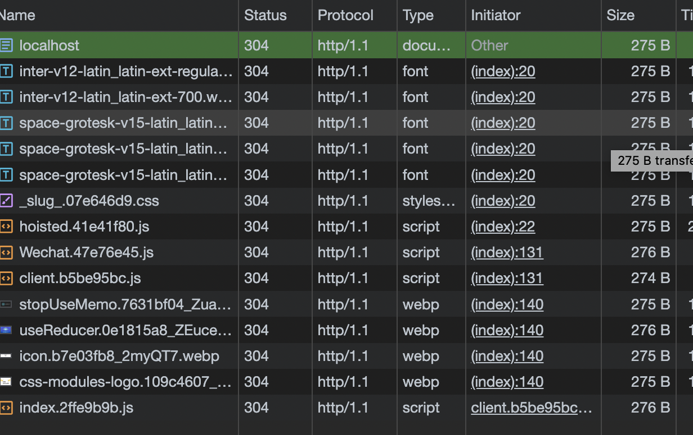
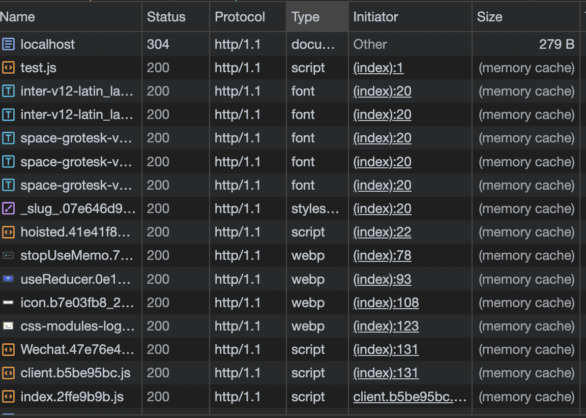

设置合适的缓存策略, 来提升网站性能, 节省云服务器带宽, **通过阅读我是如何给我的博客应用确定缓存策略, 你将了解到几种不同缓存策略的最佳实践**。

## 设置缓存的目的

当你第2次访问我的博客时, 我希望我的缓存设置能够:

1. 你看到的文章始终是最新的, 如果我重新发布了某些内容, 那么在你刷新页面后, 应该就可以看到最新的内容
2. 当你访问博客时, 我希望能尽可能少的从服务器请求资源, 以减少网络带来的延迟, 优先从缓存取数据

## 不可变内容 + 长max-age
**cache-control: max-age=31536000**

此模式适合内容长期不会更新和变动的站点, 或者用户只会访问一次不会经常访问的站点 

1. 由于内容长期不会有更新, 可以将 **max-age** 时间设置的尽可能久, 因此浏览器的缓存可以存储的很久(一年)
2. 在 **max-age** 的时间内, 都会访问浏览器的缓存, 不会请求服务器

如果将服务器缓存策略设置为这种模式, 那么当在max-age时间段内, 如果我们更新前端资源的内容, 对应服务器上资源不会请求更新,
我们应该更新前端资源的url来获取最新的资源。

```html
  <!-- 
    每次我们更新了前端资源的内容需要更改url值,服务器才会在max-age时间内重新请求,返回最新的内容
    否则将继续访问浏览器缓存
  -->
  <link rel="stylesheet" href="/styles-a837cb1e.css" />
  
  <script src="/script-x234jf5.js"></script>
```

上述前端资源的url通常包括了版本号, 修改日期或者内容哈希值, 有一些工具可以帮助生成 如node.js的服务器 [glup](https://github.com/sindresorhus/gulp-rev)。

**我的博客并没有采用该模式**。截止到该文章编写的日期, 由于本博客依旧处于快速更新内容的状态, 我的文章内容必须能够快速更改(内容更新, 文案纠错等),
本博客内容是由 **Astro** 框架自动生成的前端资源, 修改资源url可能需要额外设置的工作量, 因此我不选择使用该模式。

## 可变内容 + 服务器验证
**cache-control: no-cache**

1. no-cache并不等于禁用缓存, 而是表示使用缓存前, 都会发起服务器验证请求
2. 为了避免语法引起歧义, 可以考虑修改为 **cache-control: must-revalidate,max-age=0** 和 **no-cache** 等效

这个模式下, 服务器获取资源都会发起一个验证请求, 如果我们改变了资源内容, 那么服务器判断内容更新了, 则从请求中获取新的内容,
如果服务器判断内容未更新, 那么依旧获取旧的内容。

服务器通过返回的 **Etag** 在下次客户端请求时通过判断 **If-None-Match** 和 **If-Modified-Since** 判断内容是否修改, 如果你和我一样使用 后端web框架 [Express](https://expressjs.com/en/4x/api.html#express.static)
那么该标头通常已经被默认设置(**express.static(root, [options])**)。

如果你的网站频繁更新, 同时你的前端资源体积不会很大的情况下, 那么可以考虑把该策略设置为默认缓存策略。

但是如果你的网站前端资源数量多, 同时体积较大, 由于该模式始终会涉及服务器请求验证, 那么频繁的服务器验证可能会降低你的网站体验。

来看下使用了该模式下, 我的博客资源的缓存情况



**我的博客并没有采用该模式**。如上图我的博客有font, image, js等其他不会经常变动的资源, 注意我的博客是 [Astro](https://astro.build/) 生成的 **MPA应用**, **js文件大部分都是框架生成的默认配置, 因此也属于不常变动的资源**,
设置了 **no-cache** 后都会发起验证请求, 额外占用了服务器资源, 该模式对我的博客场景不太适合。

## 可变内容 + max-age

**cache-control: must-revalidate,max-age**

该模式结合了 [模式1](#不可变内容--长max-age) 和 [模式2](#可变内容--服务器验证) 的功能
1. 在 **max-age** 缓存时间段内优先使用缓存, 不用请求服务器验证,
2. 超过 10分钟, 则发起服务器验证请求, 如果内容校验变化了, 那么服务器下载新的内容, 如果内容不变, 继续使用缓存旧内容

来看下使用了该模式下, 我的博客资源的缓存情况


除了第一项资源 **html** 被标记了 **304 缓存验证**, 其它我视为不常变动的资源都被浏览器的缓存 **memory cache** 存储了✌🏻
当我更新博客内容时, **html**会发出一个服务器验证请求, 以获取最新内容, 其他如图片这些不常变动的资源被cache了, 不会有网络请求😎。
完美符合 [我设置缓存的目的](#设置缓存的目的)。

### 你可能不需要它

如果你的应用是 **SPA** 应用, 那么这个模式可能不适合你, 你可能需要考虑 [模式1](#不可变内容--长max-age) 或 [模式2](#可变内容--服务器验证)。

想象一下你有一个博客文章, 你使用 **react** 搭建, 你的文章内容都作为 js 的一部分渲染到 html 中, 当你更新了文章内容后

1. 你的html 正常 **304 缓存验证** 了。但是html内并没有实质的博客内容, **SPA** 应用的html 只是为了加载 js
2. 你的 js 资源被浏览器 **memory cache**, 导致新的内容并没有被服务器请求, 无法获取新内容。


## 总结

以上介绍的几种缓存策略没有绝对的好坏, 只有最适合你的缓存策略, 了解到几种策略的功能可以帮助你决定适合自己应用的缓存方案😄。

## 参考文章

1. [https://web.dev/articles/http-cache](https://web.dev/articles/http-cache)
2. [https://web.dev/articles/love-your-cache](https://web.dev/articles/love-your-cache)

