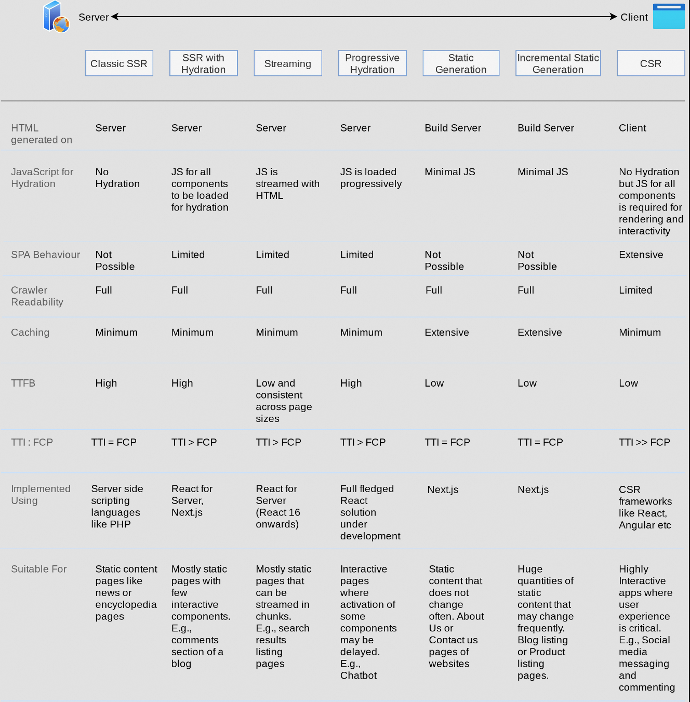

**前端渲染模式通常指的是在构建前端Web应用时, 页面内容是如何生成和呈现给用户的方法。**

想象你现在作为一名前端架构师, 有了一个很好的灵感去构建一个新的web应用, 那么在应用技术栈开始选型时, 你就应该确定好使用何种渲染模式, 选择一个合适你的业务场景的渲染模式可以大大降低你的维护成本, 
提升开发体验和用户体验。
另一方面，如果错误的模式可以毁掉一个原本可以实现充满创意的应用。因此，你必须确保您的每一个革命性想法都以适当的渲染模式进行开发。

## 渲染模式重要性

为了创建出色的用户体验, 通常我们使用 [Core Web Vitals(CWV)](https://web.dev/articles/vitals) 指标来衡量用户体验相关的参数,
诸如 **LCP** 等等, 同时如果你想要你的应用针对用户有更高的曝光率, 提升 **CWV** 也有助于同时提升应用的 [SEO](https://developers.google.com/search/docs/fundamentals/do-i-need-seo?hl=zh-cn),
一个合适正确的渲染模式可以帮助你拥有好的 **CWV** 和 **SEO**。

### SSG (Static Rending or Static Site Generation)

静态渲染或静态生成 (SSG) 尝试向客户端提供在构建网站时生成的预渲染 HTML 内容。该模式适合内容不经常变动的应用, 比如博客网站。现代web开发中有一些强大的 **SSG** 框架, 
比如本博客的开发就使用了 [Astro](https://astro.build/) 的 **SSG** 功能生成。

1. 大量的 **HTML** 文件, 需要为用户可能访问的每个可能的路由生成单独的 HTML 文件。例如，当将其用于博客时，将为数据存储中可用的每个博客文章生成一个 HTML 文件。随后，对任何帖子的编辑都需要重新构建，更新才能反映在静态 HTML 文件中。
2. SEO 友好, 由于 **html** 是预制好的内容, 我们可以自由的插入想要的 **SEO** 标签内容, 你可以使用 **Google Lighthouse** 检查一下本博客, 将会发现 **SEO** 分数将是满分😎。
3. 动态内容, 每次内容更新需要重新构建和部署 **SSG** 服务, 因此需要依赖设置正确的缓存, 关于如何设置合适的缓存策略, 建议阅读 [浏览器缓存最佳实践](https://www.songlibin.xyz/blog/cache/), 针对高度动态内容, 不建议使用 **SSG**。

## SSR (Server-Side-Rendering)

广义的服务端渲染, 前端资源如 **html** 由服务器生成并发送给客户端。**SSR** 更适合内容高度动态的应用。

1. **SEO** 友好, 由于服务器生成完整的 **html** 内容, 可以自定义 **SEO** 。
2. 首屏加载时间更快, 于客户端渲染相比, 拥有更少的 **js**, 因此 **FCP** 和 **TTI** 更快。
3. 更慢的 **TTFB**, 所有请求由服务器处理, 服务器可能会延迟或者负载过重, 
4. 有许多支持 **SSR** 的框架, 如 **Next.js**, 和 **Astro** 等等, 对于react用户来说, 如果你不想使用 **SSR** 框架或者想要更多的自定义行为, 可以使用 [React Server API](https://react.dev/reference/react-dom/server)
5. 适合高度动态, 社交或内容为主导(新闻, 博客等平台)。

以下的不是纯SSR渲染的内容, 如果用更精准的说明, 以下内容为以 **react** 为基础的 **Isomorphic Rendering** 同构渲染, 再此以更广义的 **SSR** 命名。

注意, 通常服务器返回的 **html** 在首屏渲染完后都是不可交互的(server端没有dom相关可以绑定事件), 对应返回的dom节点需要在浏览器端进行一次激活交互的行为, 
该过程被称为 [Hydration](https://react.dev/reference/react-dom/client/hydrateRoot)

从服务器接收到的 DOM 组件可能需要一段时间才能完全 **Hydration**。在组件被 **Hydration** 之前，需要加载、处理和执行客户端的 JavaScript 文件。这段时间内 无法对dom元素进行交互, 因此有一些 **Hydration** 技巧可以提高该项用户体验。

### Progressive Hydration 

渐近式 **Hydration**, 指的是逐步按需加载执行客户端 Hydration js, 不用执行整个应用的 Hydration js。

**Progressive Hydration** 可以实现代码分割, 减少包大小, 按需加载页面组件, 这些优化点是不是很熟悉呢, 其实就是常规的 **js** 优化方案, 挪到了 **Hydration** 场景中使用不同的方案实现。
具体的实现和原理不再本文讨论, 以下是一个实现的例子供参考 [react-progressive-hydration](https://github.com/GoogleChromeLabs/progressive-rendering-frameworks-samples/blob/master/react-progressive-hydration/server.js)

### Selective Hydration

[Selective Hydration](https://github.com/reactwg/react-18/discussions/37), 主要依赖于 [React 18 renderToPipeableStream](https://react.dev/reference/react-dom/server/renderToPipeableStream),

1. 想象你的服务器生成一个巨大的dom结构, 你使用 **renderToString** 返回 **html** 内容, 那么将等待整个html树 返回才会看到内容, 而 **renderToPipeableStream** 流式发送内容, 无需等待整个组件树渲染完成。
这可以显著提升用户看到页面首屏内容的速度
2. 在客户端使用 [hydrateRoot](https://react.dev/reference/react-dom/client/hydrateRoot) 并且使用 **Suspense** 包装你的整个应用组件

## CSR(Client-Side-Rendering)

客户端渲染, 加载一个最小的html, 和js资源, 在客户端动态生成页面内容。

1. 适合 **SPA** 应用, 高交互的应用, 可以是一个 ToB 的 **Saas** 应用等等。
2. SEO差, 一般 **CSR** 应用不以内容作为卖点。
3. 前后端完全隔离, 前端开发可以只顾前端的内容开发部署。
4. 首屏体验差, 如果 **JS** 资源过大, 那么 **FCP** 和 **TTI** 会对应延长, 用户体验不好
5. 服务器负载低, 更快的 **TTFB**。

**CSR** 的使用场景最广泛, 适合快速demo搭建, 富交互应用等, 在我的日常开发中, 由于负责的是ToB的Saas应用, 因此可以无脑的使用 **CSR**, 前后端完全隔离(有时候也不完全是好的, 想结合一些同构渲染的优势提升性能, 也被架构束缚了手脚, 有时 **BFF** 层还是有必要的)

**CSR** 常见的问题是随着需求迭代 **js** 的体积越来越大, 因此要有一些手段优化js, 在本文不一一列举。

## 总结

前端大致的渲染模式主要就是以上三种, **Static Rending**, **CSR**, **SSR**。根据你的需求选择合适的模式使用吧😎。
此外还有一些基于如上概念的一些变体, 如[ISR](https://nextjs.org/docs/pages/building-your-application/data-fetching/incremental-static-regeneration), [RSC](https://react.dev/blog/2020/12/21/data-fetching-with-react-server-components)等。
主要也是继承了这三种模式的特点。下表总结了几种模式的特点。

## 参考文章

1. https://github.com/reactwg/react-18/discussions/37
2. https://web.dev/articles/user-centric-performance-metrics?hl=zh-cn#in_the_lab
3. https://dev.to/this-is-learning/patterns-for-building-javascript-websites-in-2022-5a93