useReducer 不仅仅适用于复杂的状态更新逻辑，它还可以用于非常简单的状态更新。reducer的两个参数之一可以被忽略，使其成为无操作或无状态。

我认为 usereducer 非常好，但没有得到充分利用，相反 useState 则被过度利用。

人们很容易认为 useReducer 只是为了管理复杂的状态，但事实并非如此。它是为了封装状态更新逻辑，从而限制状态更新方式。因此，它也可以用于简单的状态更新，以至于reducer只需要一个动作。接下来我将总结一些reducer的种类,和适用场景来对比它和useState的区别, 以及我为什么更喜欢使用useReducer

## Actionless Reducer

#### Boolean state 状态切换


如上状态切换的场景非常常见, 在antd的组件比如Switch或 Modal 弹窗切换开关状态场景中都会用到, 下面是使用 **useState** 实现上述的场景

```javascript
  const [isOpen, setIsOpen] = useState(false);
  /* 需要额外定义一个切换状态的函数 */
  const toggleOpen = () => setIsOpen(state => !state);
```
如果上述自定义的 **toggleOpen** 需要作为 **useEffect** 的依赖, 那么需要进行额外处理
```javascript
  /* 使用useCallback 记忆, 确保每次render后 toggleOpen都是唯一不可变的, 那么就可以安全作为useEffect依赖或者传递给子组件做React.memo处理 */
  const toggleOpen = useCallback(toggleOpen, []);
```
如上, 使用useState实现状态切换函数需要我们手动编写切换逻辑, 并且还要注意可变性的问题, 下面来看看使用 **useReducer** 如何实现
```javascript
  /* reducer函数没action参数, 只有切换状态的逻辑, 即为actionless reducer */
  const [isOpen, toggleOpen] = useReducer(state => !state, false);
```
如上 **useReducer** 实现的toggleOpen方法, 比较 useState 实现的有 两点好处
1. 自带 useCallback 记忆处理, 不用额外处理
2. 简洁且只限制了一种状态类型, 即每次调用 **toggleOpen** open只可能是boolean, 在 Switch 和 Modal组件的切换开关状态尤其适用, 如果使用 useState 的 setIsOpen, 可能存在误设置成数组等其他类型的状态 

#### One-way Boolean state 单向状态切换

基于如上的状态切换actionless reducer还有一种单向的状态设置 Reducer
```javascript
  /* 无action也无state的 reducer, 调用enable方法 将固定把状态 从false => true */
  const [isEnabled, enable] = useReducer(() => true, false);
```

#### Increment Reducer 累加状态

```javascript
  /* increment 的dispatch 可作为强制render方法使用 */
  const [count, increment: forceUpdate] = useReducer(count => count + 1, 0)
```